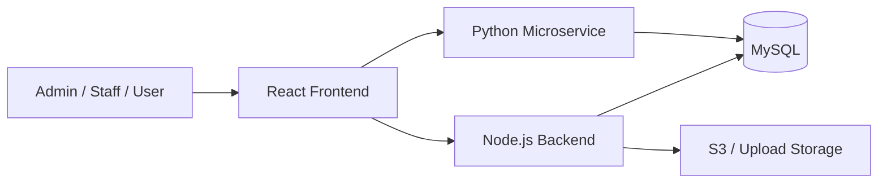

# Inventory Management System

A multi-service inventory platform for managing products, stock, suppliers, users, and orders with role-based access for `admin`, `staff`, and `user`.

## Overview

This project is built as a small distributed system:

- `frontend/`: React application for admin, staff, and user interfaces
- `backend/`: Node.js + Express API for authentication and core business logic
- `microservice/`: Python FastAPI service for analytics and CSV exports
- `database/`: MySQL schema and initialization SQL

The platform supports:

- authentication and role-based access
- product, category, supplier, and user management
- order placement and status tracking
- stock monitoring and low-stock alerts
- dashboards and reporting
- CSV exports
- product image upload via local storage / S3 flow

## Architecture



## Tech Stack

### Frontend

- React
- Vite
- React Router
- Axios
- Bootstrap
- Recharts

### Backend

- Node.js
- Express
- JWT
- bcrypt
- MySQL2
- Multer
- Nodemailer

### Python Microservice

- FastAPI
- Uvicorn
- SQLAlchemy
- Pandas
- PyMySQL

### Infrastructure

- Docker
- Docker Compose
- AWS EC2
- AWS S3
- AWS RDS
- GitHub Actions

## Repository Structure

```text
inventory-ms/
├─ backend/
│  ├─ app.js
│  ├─ controllers/
│  ├─ routes/
│  ├─ middleware/
│  ├─ utils/
│  └─ Dockerfile
├─ frontend/
│  ├─ src/
│  ├─ public/
│  └─ package.json
├─ microservice/
│  ├─ app/
│  │  ├─ db/
│  │  ├─ routes/
│  │  └─ services/
│  └─ Dockerfile
├─ database/
│  └─ schema.sql
├─ .github/workflows/
├─ docker-compose.yml
└─ README.md
```

## Main Functional Modules

### Authentication

- user registration
- login with JWT
- forgot password via email
- reset password using token

### Role-Based Access

- `admin`
  - dashboard
  - users
  - products
  - categories
  - suppliers
  - orders
- `staff`
  - dashboard
  - products
  - orders
- `user`
  - products
  - own orders
  - profile

### Inventory Management

- create, update, delete products
- assign categories and suppliers
- upload product images
- search and filter products
- low stock / out of stock indicators

### Order Management

- users can place orders
- users can cancel eligible orders
- admin/staff can update order status
- stock is reduced on order placement
- stock is restored on cancellation

### Reporting

- dashboard KPI cards
- order trend chart
- stock by category
- top products
- order status summary
- CSV export for products, stock, and orders

## How It Works

### Frontend

The React frontend:

- manages routing and layouts
- keeps login state in context/local storage
- calls the backend with Axios
- shows dashboards, tables, forms, modals, and loading states

### Backend

The Node.js backend:

- validates and processes requests
- enforces permissions using JWT and role middleware
- performs CRUD operations
- handles order logic and stock consistency
- manages uploads and password reset emails

### Python Microservice

The Python microservice:

- connects to the same MySQL database
- runs analytics queries
- transforms result sets using pandas
- returns JSON for charts and CSV downloads for exports

## Local Setup

### Prerequisites

- Node.js 18+
- Python 3.11+
- MySQL 8+ or Docker
- npm
- pip

### 1. Clone the repository

```bash
git clone <your-repo-url>
cd inventory-ms
```

### 2. Create environment file

Copy `.env.example` to `.env` and update values.

Example variables used by the project:

```env
DB_HOST=localhost
DB_USER=root
DB_PASSWORD=yourpassword
DB_NAME=inventory_ms

PORT=5000
MICRO_PORT=5001
JWT_SECRET=your-secret
FRONTEND_URL=http://localhost:5173

EMAIL_USER=your-email
EMAIL_PASS=your-email-password

AWS_REGION=ap-south-1
AWS_ACCESS_KEY_ID=your-access-key
AWS_SECRET_ACCESS_KEY=your-secret-key
S3_UPLOADS_BUCKET=your-bucket
```

### 3. Start the database

Option A: use Docker Compose

```bash
docker compose up db -d
```

Option B: create the database manually and run:

```bash
mysql -u root -p < database/schema.sql
```

### 4. Run the backend

```bash
cd backend
npm install
npm run dev
```

Backend default URL:

```text
http://localhost:5000
```

### 5. Run the frontend

```bash
cd frontend
npm install
npm run dev
```

Frontend default URL:

```text
http://localhost:5173
```

### 6. Run the Python microservice

```bash
cd microservice
pip install -r requirements.txt
python main.py
```

Microservice default URL:

```text
http://localhost:5001
```

## Docker Setup

The project includes:

- [docker-compose.yml](/abs/path/e:/inventory-ms/docker-compose.yml)
- [backend/Dockerfile](/abs/path/e:/inventory-ms/backend/Dockerfile)
- [microservice/Dockerfile](/abs/path/e:/inventory-ms/microservice/Dockerfile)

Run all configured services:

```bash
docker compose up --build
```

This starts:

- MySQL database
- Node.js backend
- Python microservice

Note: the frontend is currently run separately through Vite and is not part of `docker-compose.yml`.

## API Services

### Backend

Main route groups:

- `/api/auth`
- `/api/products`
- `/api/categories`
- `/api/suppliers`
- `/api/orders`
- `/api/users`
- `/api/upload`

Health endpoint:

- `/health`

### Python Microservice

Main route groups:

- `/api/charts/orders-per-day`
- `/api/charts/stock-by-category`
- `/api/charts/top-products`
- `/api/charts/order-status`
- `/api/export/orders`
- `/api/export/stock`

Health endpoint:

- `/health`

## AWS Deployment

The repository is structured for AWS-based deployment:

- `Frontend`
  - built and deployed to S3
- `Backend`
  - deployed to EC2
- `Microservice`
  - deployed to EC2
- `Database`
  - hosted on RDS MySQL
- `Uploads`
  - stored in S3 bucket

## CI/CD

GitHub Actions workflows are present under [.github/workflows](/abs/path/e:/inventory-ms/.github/workflows):

- [frontend.yml](/abs/path/e:/inventory-ms/.github/workflows/frontend.yml)
  - builds frontend and uploads to S3
- [backend.yml](/abs/path/e:/inventory-ms/.github/workflows/backend.yml)
  - deploys backend to EC2 over SSH
- [microservice.yml](/abs/path/e:/inventory-ms/.github/workflows/microservice.yml)
  - deploys microservice to EC2 over SSH

## UAT and Documentation

Project documents created for handoff and testing:

- [UAT_TEST_CASES.md](/abs/path/e:/inventory-ms/UAT_TEST_CASES.md)
- [UAT_TEST_CASES_EXCEL.csv](/abs/path/e:/inventory-ms/UAT_TEST_CASES_EXCEL.csv)
- [PROJECT_PRESENTATION_PPT.md](/abs/path/e:/inventory-ms/PROJECT_PRESENTATION_PPT.md)
- [PROJECT_PRESENTATION_PPT_10_SLIDES.md](/abs/path/e:/inventory-ms/PROJECT_PRESENTATION_PPT_10_SLIDES.md)

## Notes

- Some application features appear to have evolved beyond the initial SQL schema, so schema alignment should be verified before production rollout.
- Secrets in `.env` should be stored securely and never committed to source control.
- For production, consider adding HTTPS, reverse proxying, centralized logging, and automated tests.

## Future Improvements

- automated unit and integration testing
- schema migration tooling
- centralized monitoring and logs
- stronger secret management
- CloudFront/CDN for frontend delivery
- container-based production deployment

## License

Add your project license here.

