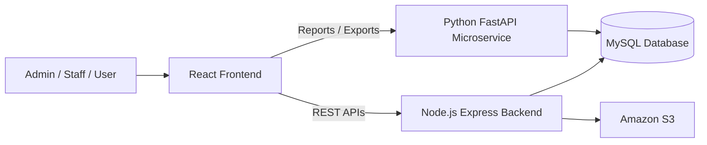
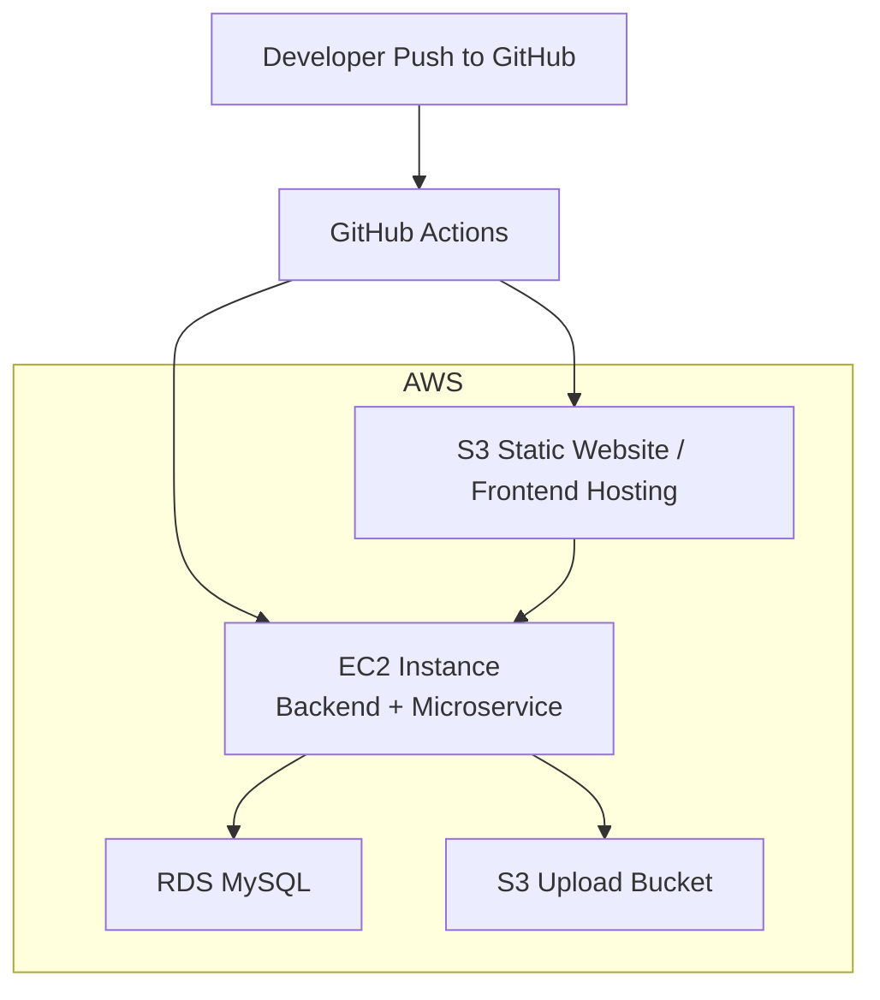
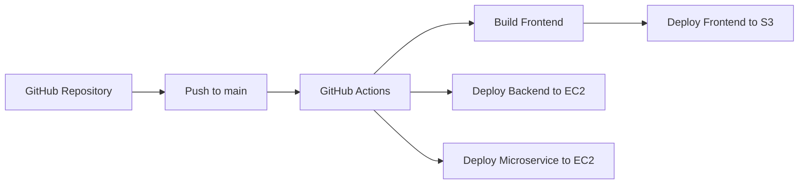

# Inventory Management System - Manager Presentation

This file is written in slide format so you can copy it into PowerPoint or Google Slides directly.

---

## Slide 1: Title

**Inventory Management System**

- Role-based inventory and order management platform
- Built with React, Node.js, Python FastAPI, and MySQL
- Deployment-ready architecture using AWS and GitHub Actions

**Presented by:**  
`Your Name`

---

## Slide 2: Project Overview

**What this project does**

- Manages products, categories, suppliers, users, stock, and orders
- Supports different user roles: `Admin`, `Staff`, and `User`
- Provides dashboards, low-stock alerts, and order insights
- Supports CSV export and reporting through a dedicated microservice

**Business value**

- Centralizes inventory operations
- Reduces manual stock tracking
- Improves order visibility
- Enables management reporting

---

## Slide 3: Key Features

**Core features**

- Secure login, registration, forgot password, reset password
- Role-based access control
- Product management with image upload
- Category and supplier management
- User management by admin
- Order placement, cancellation, and status updates
- Dashboard with KPIs and charts
- CSV export for products and orders

---

## Slide 4: Technology Stack

**Frontend**

- React
- Vite
- React Router
- Axios
- Bootstrap
- Recharts

**Backend**

- Node.js
- Express
- JWT
- bcrypt
- MySQL2
- Multer
- Nodemailer

**Microservice**

- Python
- FastAPI
- SQLAlchemy
- Pandas
- PyMySQL

**Infrastructure**

- AWS EC2
- AWS S3
- AWS RDS
- GitHub Actions
- Docker / Docker Compose

---

## Slide 5: Overall System Architecture

**Explanation**

- Frontend handles user interaction
- Backend handles business logic and security
- Python microservice handles analytics and exports
- MySQL stores all operational data
- S3 stores frontend build and uploaded images

---

## Slide 6: Frontend Architecture

**Frontend responsibilities**

- User interface for admin, staff, and users
- Route-based navigation and role protection
- Form validation and user feedback
- Dashboard visualization and filtering
- API communication with backend services

**Main logic**

- `AuthContext` stores login session
- `PrivateRoute` restricts access by role
- `Axios` attaches JWT token automatically
- Shared components improve reuse:
  - Sidebar
  - Header
  - Footer
  - ConfirmModal
  - SkeletonTable

---

## Slide 7: Backend Architecture

**Main backend responsibilities**

- Authentication and authorization
- CRUD operations for products, categories, suppliers, and users
- Order processing and stock updates
- Profile management
- Password reset by email
- Product image upload support

**Important logic**

- JWT-based authentication
- Role middleware for `admin`, `staff`, `user`
- Transaction-safe order placement
- Stock restoration on cancellation
- Request security with Helmet, CORS, and rate limiting

---

## Slide 8: Python Microservice

**Why a separate microservice**

- Keeps reporting logic isolated from core transaction logic
- Makes analytics and exports easier to maintain
- Uses Python data tools effectively

**Responsibilities**

- Orders per day
- Stock by category
- Top-selling products
- Order status summary
- CSV export for orders and stock

**Libraries used**

- FastAPI
- Uvicorn
- SQLAlchemy
- Pandas
- PyMySQL
- python-dotenv

---

## Slide 9: Database Design

**Main entities**

- Users
- Products
- Categories
- Suppliers
- Orders
- Logs

**Database choice**

- MySQL for structured relational data
- Good fit for inventory, users, and order relationships

**Hosted on AWS**

- Amazon RDS for MySQL
- Central database shared by backend and microservice

---

## Slide 10: AWS Deployment Architecture

**Current/target deployment view**

- Frontend is built and uploaded to S3
- Backend is deployed to EC2
- Python microservice is deployed to EC2
- Database is hosted in RDS
- Product images are stored in S3

---

## Slide 11: AWS Services Used

**Amazon EC2**

- Hosts Node.js backend
- Hosts Python microservice
- Supports PM2-based process management in current deployment workflow

**Amazon S3**

- Hosts frontend static build
- Stores uploaded product images

**Amazon RDS**

- Hosts MySQL database
- Central persistent data layer

**Why AWS**

- Scalable
- Reliable
- Easy integration with CI/CD
- Managed services reduce operational effort

---

## Slide 12: Docker and Containerization

**Docker support in project**

- Backend has a Dockerfile
- Microservice has a Dockerfile
- `docker-compose.yml` orchestrates local services

**Backend Dockerfile**

- Uses `node:18-alpine`
- Installs production dependencies
- Runs Express app

**Microservice Dockerfile**

- Uses `python:3.11-slim`
- Installs requirements
- Runs FastAPI app

**Benefits**

- Consistent environments
- Easier deployment
- Better portability across systems

---

## Slide 13: CI/CD with GitHub Actions

**Current GitHub Actions workflows**

- `frontend.yml`
  - installs dependencies
  - builds frontend
  - deploys build to S3

- `backend.yml`
  - connects to EC2 through SSH
  - pulls latest code
  - updates environment values
  - installs dependencies
  - restarts backend with PM2

- `microservice.yml`
  - connects to EC2 through SSH
  - pulls latest code
  - installs requirements
  - restarts microservice with PM2

---

## Slide 14: CI/CD Flow Diagram

**Outcome**

- Faster deployments
- Less manual work
- More reliable release process

---

## Slide 15: Security and Validation

**Application security**

- JWT authentication
- Role-based authorization
- Password hashing using bcrypt
- Rate limiting on auth APIs
- Helmet security headers
- Restricted CORS

**Frontend validation**

- Required fields
- Email format validation
- Password strength rules
- Minimum name and address length
- Friendly loading state using `SkeletonTable`

---

## Slide 16: UAT Coverage

**UAT areas covered**

- Authentication
- Authorization
- Session handling
- Dashboard
- Products
- Categories
- Suppliers
- Users
- Orders
- Profile
- Reporting
- UI/UX
- Error handling

**Artifacts prepared**

- `UAT_TEST_CASES.md`
- `UAT_TEST_CASES_EXCEL.csv`

---

## Slide 17: Strengths of the Project

**What is strong in this implementation**

- Clear separation between UI, business logic, reporting, and data
- Role-based design for real business usage
- Dedicated analytics microservice
- AWS-ready deployment model
- CI/CD already set up in GitHub Actions
- Dockerized services for consistency
- Strong UAT coverage for business flows

---

## Slide 18: Current Gaps / Improvement Opportunities

**Areas to improve**

- Add formal monitoring and logging dashboard
- Add automated test suite for backend and frontend
- Add HTTPS and reverse proxy setup if not already configured
- Improve secret management using AWS Secrets Manager or Parameter Store
- Align database schema fully with latest application fields
- Add autoscaling or separate EC2 instances if traffic grows

---

## Slide 19: Future Roadmap

**Recommended next steps**

- Add automated unit and integration tests
- Move to full container-based deployment on ECS or EKS if scale increases
- Add CloudFront in front of S3 frontend hosting
- Add centralized logging and alerts
- Add audit reporting and advanced analytics
- Add approval workflow for inventory/order operations

---

## Slide 20: Closing Summary

**Summary**

- This is a multi-tier inventory platform with role-based workflows
- React frontend provides the user experience
- Node.js backend handles business operations
- Python microservice handles reporting and exports
- AWS supports deployment through EC2, S3, and RDS
- GitHub Actions provides CI/CD automation
- Docker improves deployment consistency

**Closing line**

“The project is structured for real-world operational use, with clear separation of concerns, cloud deployment readiness, and a scalable foundation for future growth.”

---

## Optional Speaker Notes

### Short opening

“This project is an Inventory Management System designed for admins, staff, and users. It manages inventory operations end to end, from product setup to order handling and reporting.”

### Short closing

“Overall, the project is not just a CRUD application. It is a role-based, cloud-ready business system with operational workflows, reporting support, AWS deployment integration, and CI/CD automation.”

