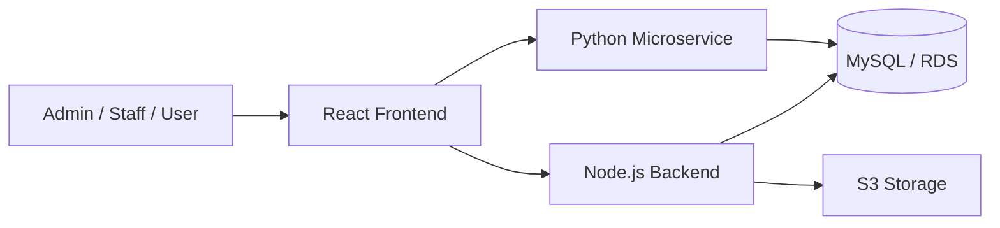

# Inventory Management System - 10 Slide Manager Version

---

## Slide 1: Title

**Inventory Management System**

- Role-based inventory and order management platform
- Built for operational control, reporting, and scalability
- Cloud-ready with AWS and CI/CD support

---

## Slide 2: Business Overview

**Project purpose**

- Manage products, stock, suppliers, users, and orders in one system
- Provide different access for Admin, Staff, and User
- Improve visibility into stock movement and order activity
- Reduce manual tracking through dashboards and exports

---

## Slide 3: Key Functionalities

- Secure login, registration, forgot password, and reset password
- Product, category, supplier, and user management
- Order placement, cancellation, and status updates
- Role-based dashboards
- Low-stock monitoring
- CSV export and reporting support

---

## Slide 4: Solution Architecture

- Frontend handles user interaction
- Backend handles business logic
- Python microservice handles reports and exports
- MySQL stores operational data
- S3 supports file/static storage

---

## Slide 5: Technology Stack

**Frontend**

- React, Vite, Axios, React Router, Recharts

**Backend**

- Node.js, Express, JWT, bcrypt, MySQL2

**Microservice**

- Python, FastAPI, SQLAlchemy, Pandas

**Infrastructure**

- AWS EC2, S3, RDS, GitHub Actions, Docker

---

## Slide 6: AWS Deployment Model

- **EC2** hosts backend and Python microservice
- **S3** hosts frontend build and uploaded product images
- **RDS MySQL** stores application data
- Shared cloud deployment supports separation of frontend, API, reporting, and data layers

**Benefit**

- Reliable hosting
- Better scalability
- Cleaner production deployment model

---

## Slide 7: CI/CD and Docker

**CI/CD**

- GitHub Actions automates deployment
- Frontend workflow builds and uploads to S3
- Backend workflow deploys to EC2
- Microservice workflow deploys to EC2

**Docker**

- Dockerfiles exist for backend and microservice
- Docker Compose supports local multi-service setup

---

## Slide 8: Security and Core Logic

- JWT authentication and role-based authorization
- Password hashing using bcrypt
- CORS, Helmet, and rate limiting for API security
- Stock is updated during order placement
- Stock is restored when orders are cancelled
- Profile and password management are included

---

## Slide 9: Testing and Readiness

- UAT test cases prepared for all major modules
- Covers authentication, products, users, orders, reporting, profile, and UI behavior
- Excel-style UAT sheet created for execution tracking

**Readiness**

- Good functional coverage
- Deployment automation exists
- Clear path for staging and production rollout

---

## Slide 10: Summary and Next Steps

**Summary**

- Multi-role business application with inventory and order workflows
- Clear separation of frontend, backend, reporting, and database layers
- AWS-ready deployment with CI/CD support
- Strong foundation for operational usage

**Recommended next steps**

- Add automated testing
- Improve monitoring and logging
- Strengthen secret management
- Continue production hardening and scaling

